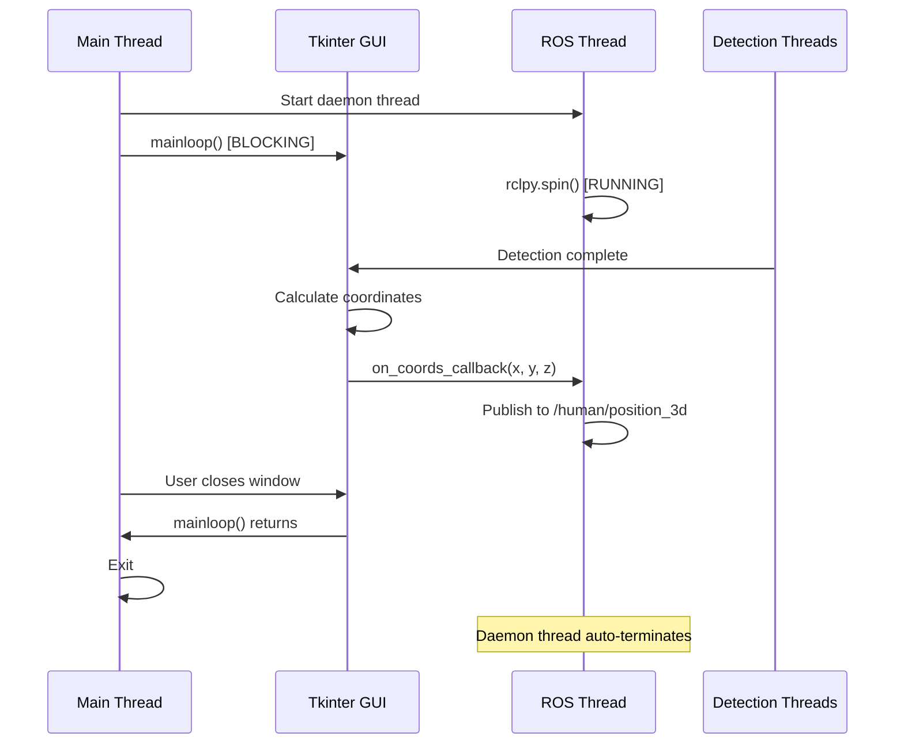

# ROS 2 Integration for Human Tracker

Complete guide for integrating the dual camera human tracker with ROS 2.

## Table of Contents

1. [Overview](#overview)
2. [Quick Start](#quick-start)
3. [Installation](#installation)
4. [Usage](#usage)
5. [Threading Strategy](#threading-strategy)
6. [Topic Reference](#topic-reference)
7. [Examples](#examples)
8. [Troubleshooting](#troubleshooting)
9. [API Reference](#api-reference)

## Overview

This integration adds ROS 2 publishing capabilities to the existing dual camera human tracker without modifying the core application logic. The tracker publishes 3D human position coordinates to the `/human/position_3d` topic.

### Key Features

- ✅ **Minimal Changes**: Only 10 lines added to original script
- ✅ **Backward Compatible**: Original script works without ROS 2
- ✅ **Thread-Safe**: Proper threading for GUI + ROS 2
- ✅ **Clean Architecture**: Wrapper pattern separates concerns
- ✅ **ROS 2 Compatible**: Works with Humble and Foxy

### Architecture

```mermaid
graph TB
    subgraph "Main Thread"
        A[Tkinter GUI Mainloop]
        B[ObjectDetectionApp]
    end
    
    subgraph "ROS Thread"
        C[RosHumanTrackerNode]
        D[rclpy.spin]
    end
    
    subgraph "Detection Threads"
        E[Camera 1 Detection]
        F[Camera 2 Detection]
    end
    
    B -->|Coordinates| C
    E -->|Detection| B
    F -->|Detection| B
    C -->|Publish| G[/human/position_3d]
    D -.->|Spins| C
```

## Quick Start

### Prerequisites

- ROS 2 Humble or Foxy installed
- Python 3.8+
- Two cameras (or one camera used twice)

### Run in 3 Steps

1. **Apply minimal changes to original script** (see [Installation](#installation))

2. **Run with ROS 2**:
   ```bash
   source /opt/ros/humble/setup.bash
   python ros_human_tracker_node.py
   ```

3. **Verify topic publishing**:
   ```bash
   ros2 topic echo /human/position_3d
   ```

## Installation

### Step 1: Modify Original Script

Apply these minimal changes to [`object_detection_app.py`](../object_detection_app.py):

#### Change 1: Add callback attribute (line 386)

```python
self.on_coords_callback = None  # Callback for external coordinate consumers (e.g., ROS 2)
```

#### Change 2: Trigger callback (line 836)

```python
# Trigger callback if registered (e.g., for ROS 2 publishing)
if self.on_coords_callback is not None:
    try:
        self.on_coords_callback(
            self.current_coordinates["x"],
            self.current_coordinates["y"],
            self.current_coordinates["z"]
        )
    except Exception as e:
        print(f"Error in coordinate callback: {e}")
```

See [`object_detection_app_ros2_changes.md`](object_detection_app_ros2_changes.md) for complete diff.

### Step 2: Install Dependencies

```bash
# Install Python dependencies
pip install rclpy geometry_msgs opencv-python ultralytics pillow

# Or use requirements.txt
pip install -r requirements.txt
```

### Step 3: Create ROS 2 Node File

Copy the content from [`ros_human_tracker_node.py.md`](ros_human_tracker_node.py.md) to `ros_human_tracker_node.py`.

### Step 4: (Optional) Create ROS 2 Package

For a proper ROS 2 package structure, follow the instructions in [`ros2-package-config.md`](ros2-package-config.md).

## Usage

### Basic Usage

```bash
# Source ROS 2 environment
source /opt/ros/humble/setup.bash

# Run the tracker with ROS 2 enabled
python ros_human_tracker_node.py
```

### Using as ROS 2 Package

```bash
# Build the package
cd ~/ros2_ws
colcon build --packages-select human_tracker

# Source workspace
source install/setup.bash

# Run the node
ros2 run human_tracker human_tracker_node
```

### Without ROS 2 (Original Behavior)

```bash
# Run original script without any ROS 2 functionality
python object_detection_app.py
```

## Threading Strategy

### The Challenge

- Tkinter's `mainloop()` is **blocking** and must run on the **main thread**
- ROS 2 requires continuous `rclpy.spin()` to process callbacks and publish messages
- Both need to run simultaneously

### The Solution: Daemon Thread

```python
# Main thread runs GUI (blocking)
app_root.mainloop()

# ROS 2 runs in daemon thread (background)
ros_thread = threading.Thread(target=run_ros_node, args=(ros_node,), daemon=True)
ros_thread.start()
```

### Why Daemon Thread?

1. **Automatic Cleanup**: Daemon threads are killed when the main thread exits
2. **No Blocking**: ROS runs in background without blocking GUI
3. **Clean Shutdown**: When GUI closes, ROS thread terminates automatically
4. **Thread-Safe**: ROS 2 publishing is thread-safe in rclpy

### Thread Flow



### Thread Safety

- ✅ ROS publishing is thread-safe in rclpy
- ✅ Coordinate updates happen in detection threads
- ✅ Callback wrapped in try-except for safety
- ✅ No shared mutable state between threads

## Topic Reference

### Topic: `/human/position_3d`

**Message Type**: `geometry_msgs/msg/Point`

**QoS**: Best Effort (default)

**Frequency**: Depends on detection interval (default: 5 seconds)

**Message Structure**:

```python
# geometry_msgs/msg/Point
float64 x  # X coordinate in meters (left-right position)
float64 y  # Y coordinate in meters (front-back position)
float64 z  # Z coordinate in meters (height/vertical position)
```

**Coordinate System**:

- **X**: Left-right position in room (negative = left, positive = right)
- **Y**: Front-back position in room (negative = back, positive = front)
- **Z**: Height above floor (always positive or zero)

**Example Output**:

```bash
$ ros2 topic echo /human/position_3d
---
x: 1.23
y: 2.45
z: 1.67
---
x: 1.25
y: 2.47
z: 1.68
---
```

## Examples

### Example 1: Monitor Topic

```bash
# Terminal 1: Run tracker
source /opt/ros/humble/setup.bash
python ros_human_tracker_node.py

# Terminal 2: Monitor topic
source /opt/ros/humble/setup.bash
ros2 topic echo /human/position_3d
```

### Example 2: Check Topic Frequency

```bash
# Monitor publishing frequency
ros2 topic hz /human/position_3d

# Expected output (with 5s interval):
# average rate: 0.200
```

### Example 3: Visualize in RViz2

```bash
# Start RViz2
rviz2

# In RViz2:
# 1. Add "PointStamped" display
# 2. Set Fixed Frame to "map" or "base_link"
# 3. Set Topic to "/human/position_3d"
# 4. You'll see points appearing as person moves
```

### Example 4: Subscribe with Python

```python
#!/usr/bin/env python3
import rclpy
from rclpy.node import Node
from geometry_msgs.msg import Point

class CoordinateSubscriber(Node):
    def __init__(self):
        super().__init__('coordinate_subscriber')
        self.subscription = self.create_subscription(
            Point,
            '/human/position_3d',
            self.coordinate_callback,
            10
        )
    
    def coordinate_callback(self, msg):
        self.get_logger().info(
            f'Received: x={msg.x:.2f}, y={msg.y:.2f}, z={msg.z:.2f}'
        )

def main():
    rclpy.init()
    subscriber = CoordinateSubscriber()
    rclpy.spin(subscriber)
    subscriber.destroy_node()
    rclpy.shutdown()

if __name__ == '__main__':
    main()
```

### Example 5: Calculate Distance from Origin

```python
#!/usr/bin/env python3
import rclpy
from rclpy.node import Node
from geometry_msgs.msg import Point
import math

class DistanceCalculator(Node):
    def __init__(self):
        super().__init__('distance_calculator')
        self.subscription = self.create_subscription(
            Point,
            '/human/position_3d',
            self.coordinate_callback,
            10
        )
    
    def coordinate_callback(self, msg):
        # Calculate distance from origin (0, 0, 0)
        distance = math.sqrt(msg.x**2 + msg.y**2 + msg.z**2)
        self.get_logger().info(f'Distance from origin: {distance:.2f}m')

def main():
    rclpy.init()
    calculator = DistanceCalculator()
    rclpy.spin(calculator)
    calculator.destroy_node()
    rclpy.shutdown()

if __name__ == '__main__':
    main()
```

## Troubleshooting

### Issue: "ModuleNotFoundError: No module named 'rclpy'"

**Solution**:
```bash
# Source ROS 2 environment
source /opt/ros/humble/setup.bash

# Install rclpy
pip install rclpy
```

### Issue: Topic not publishing

**Possible Causes**:

1. **Detection not active**: Click "Start Detection" button in GUI
2. **No person detected**: Ensure a person is visible in camera
3. **Wrong topic name**: Verify topic is `/human/position_3d`

**Debug**:
```bash
# Check if topic exists
ros2 topic list | grep human

# Check topic info
ros2 topic info /human/position_3d

# Check if node is running
ros2 node list | grep human_tracker
```

### Issue: GUI freezes

**Cause**: ROS thread not running as daemon

**Solution**: Ensure `daemon=True` is set when creating ROS thread:
```python
ros_thread = threading.Thread(target=run_ros_node, args=(ros_node,), daemon=True)
```

### Issue: Coordinates not updating

**Possible Causes**:

1. **Detection interval too long**: Reduce interval in GUI
2. **Person not in frame**: Ensure person is visible
3. **Wrong marker class**: Check "Red Dot Marker" dropdown is set to "person"

**Debug**:
```bash
# Check if coordinates are being calculated
# Look at GUI coordinate display
# Should show real-time updates when person is detected
```

### Issue: Import errors

**Solution**:
```bash
# Ensure object_detection_app.py is in same directory
ls -la object_detection_app.py

# Ensure ros_human_tracker_node.py is in same directory
ls -la ros_human_tracker_node.py

# Check Python path
python -c "import sys; print(sys.path)"
```

### Issue: Camera not detected

**Solution**:
```bash
# Check available cameras
python -c "import cv2; print([i for i in range(5) if cv2.VideoCapture(i).isOpened()])"

# Try different camera indices in the GUI
```

## API Reference

### RosHumanTrackerNode

#### Constructor

```python
RosHumanTrackerNode(tracker_instance=None)
```

**Parameters**:
- `tracker_instance` (ObjectDetectionApp, optional): Tracker instance to wrap

**Example**:
```python
node = RosHumanTrackerNode()
# Later attach to tracker
node.attach_to_tracker(tracker)
```

#### Methods

##### attach_to_tracker()

```python
attach_to_tracker(tracker_instance=None)
```

Attach the node to a tracker instance.

**Parameters**:
- `tracker_instance` (ObjectDetectionApp, optional): Tracker instance to attach to

##### publish_coordinates()

```python
publish_coordinates(x, y, z)
```

Publish coordinates to the ROS topic. This is called automatically by the tracker callback.

**Parameters**:
- `x` (float): X coordinate in meters
- `y` (float): Y coordinate in meters
- `z` (float): Z coordinate in meters

##### get_statistics()

```python
get_statistics() -> dict
```

Get publishing statistics.

**Returns**:
- Dictionary with keys:
  - `publish_count` (int): Total number of coordinates published
  - `last_publish_time` (Time): Time of last publish

**Example**:
```python
stats = node.get_statistics()
print(f"Published {stats['publish_count']} coordinates")
```

### Callback Function

The tracker calls the callback function whenever coordinates are updated:

```python
def on_coords_callback(x, y, z):
    """
    Callback function signature.
    
    Parameters:
        x (float): X coordinate in meters
        y (float): Y coordinate in meters
        z (float): Z coordinate in meters
    """
    pass
```

## Additional Resources

- [ROS 2 Python Tutorials](https://docs.ros.org/en/humble/Tutorials/Python.html)
- [geometry_msgs Documentation](http://docs.ros.org/en/api/geometry_msgs/html/msg/Point.html)
- [rclpy Documentation](https://docs.ros.org/en/humble/Concepts/About-ROS-2-Client-Libraries.html)
- [YOLOv8 Documentation](https://docs.ultralytics.com/)

## Summary

This ROS 2 integration provides:

✅ Minimal changes to original code (10 lines)  
✅ Clean separation of concerns  
✅ Thread-safe implementation  
✅ Backward compatibility  
✅ Easy to use and maintain  
✅ ROS 2 best practices  

The wrapper approach ensures that the original application remains functional and can still be used independently, while adding ROS 2 capabilities when needed.
