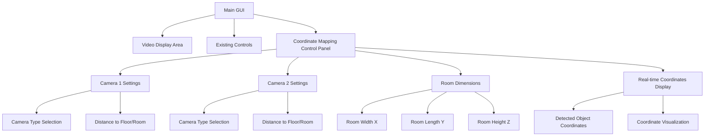

# Coordinate Mapping Control Panel Design

## Overview
This document outlines the design for adding a control panel to map image pixel coordinates to real-world 3D coordinates (X, Y, Z) where (0, 0, 0) represents the center of the room on the floor.

## System Architecture

### Camera Setup
- **Top Camera (Ceiling)**: Detects X and Y coordinates (horizontal position on floor)
- **Front Camera**: Detects Z coordinate (elevation/height from floor)

### Coordinate System
```
Origin (0, 0, 0): Center of room on the floor
- X: Left/Right position (negative = left, positive = right)
- Y: Front/Back position (negative = back, positive = front)
- Z: Height above floor (always positive or zero)
```

## UI Design

### Control Panel Layout
The control panel will be added at the bottom of the main GUI, below the existing controls.



### Input Fields Required

#### Camera 1 Settings (Top Camera - Ceiling)
- **Camera Type**: Dropdown to select "Top/Ceiling" or "Front"
- **Distance to Floor**: Input field (in meters or centimeters)
  - This is the vertical distance from the ceiling camera to the floor

#### Camera 2 Settings (Front Camera)
- **Camera Type**: Dropdown to select "Top/Ceiling" or "Front"
- **Distance to Room**: Input field (in meters or centimeters)
  - This is the horizontal distance from the front camera to the center of the room

#### Room Dimensions
- **Room Width (X-axis)**: Input field (in meters or centimeters)
- **Room Length (Y-axis)**: Input field (in meters or centimeters)
- **Room Height (Z-axis)**: Input field (in meters or centimeters)

#### Real-time Coordinate Display
- **Current Object Coordinates**: Display showing (X, Y, Z) in real-world units
- **Last Detection Time**: Timestamp of last coordinate calculation
- **Coordinate Status**: Indicator showing if coordinates are valid

## Coordinate Transformation Logic

### Pixel-to-World Coordinate Mapping

#### For Top Camera (Ceiling) - X and Y Coordinates
```
Given:
- camera_height: Distance from ceiling camera to floor
- room_width: Total width of the room
- room_length: Total length of the room
- image_width: Width of camera image in pixels
- image_height: Height of camera image in pixels
- pixel_x, pixel_y: Detected object center in image coordinates

Calculations:
- normalized_x = (pixel_x - image_width / 2) / (image_width / 2)
- normalized_y = (pixel_y - image_height / 2) / (image_height / 2)
- world_x = normalized_x * (room_width / 2)
- world_y = normalized_y * (room_length / 2)

Note: May need to invert Y depending on camera orientation
```

#### For Front Camera - Z Coordinate (Elevation)
```
Given:
- camera_distance: Distance from front camera to room center
- room_height: Total height of the room
- image_width: Width of camera image in pixels
- image_height: Height of camera image in pixels
- pixel_x, pixel_y: Detected object center in image coordinates

Calculations:
- normalized_z = (pixel_y - image_height / 2) / (image_height / 2)
- world_z = normalized_z * (room_height / 2)

Note: May need calibration based on camera angle and distance
```

### Enhanced Z Coordinate Calculation (Perspective Correction)
```
For more accurate Z coordinate calculation with perspective:

Given:
- camera_distance: Distance from front camera to room
- camera_height: Height of front camera from floor
- fov_vertical: Vertical field of view of camera
- pixel_y: Y-coordinate of detected object in image

Calculations:
- angle_from_center = (pixel_y - image_height / 2) / (image_height / 2) * (fov_vertical / 2)
- world_z = camera_distance * tan(angle_from_center + camera_angle)

Where camera_angle is the downward angle of the front camera
```

## Implementation Plan

### Step 1: Add UI Components to [`setup_gui()`](object_detection_app.py:408)
- Create new `coordinate_frame` LabelFrame below existing controls
- Add input fields for camera distances
- Add input fields for room dimensions
- Add coordinate display labels

### Step 2: Add Instance Variables to [`__init__()`](object_detection_app.py:332)
```python
# Coordinate mapping variables
self.camera1_type = tk.StringVar(value="top")  # "top" or "front"
self.camera2_type = tk.StringVar(value="front")
self.camera1_distance = tk.DoubleVar(value=3.0)  # meters
self.camera2_distance = tk.DoubleVar(value=2.0)  # meters
self.room_width = tk.DoubleVar(value=6.0)  # meters
self.room_length = tk.DoubleVar(value=8.0)  # meters
self.room_height = tk.DoubleVar(value=3.0)  # meters

# Real-time coordinate storage
self.current_coordinates = {"x": 0.0, "y": 0.0, "z": 0.0}
self.last_coordinate_time = None
```

### Step 3: Implement Coordinate Transformation Function
```python
def pixel_to_world_coordinates(self, pixel_x, pixel_y, camera_num):
    """
    Convert pixel coordinates to real-world 3D coordinates
    
    Args:
        pixel_x: X-coordinate in image (pixels)
        pixel_y: Y-coordinate in image (pixels)
        camera_num: 1 for top camera, 2 for front camera
    
    Returns:
        Dictionary with x, y, z coordinates in meters
    """
    # Get camera resolution
    if camera_num == 1:
        image_width = self.cap1.get(cv2.CAP_PROP_FRAME_WIDTH)
        image_height = self.cap1.get(cv2.CAP_PROP_FRAME_HEIGHT)
        camera_type = self.camera1_type.get()
    else:
        image_width = self.cap2.get(cv2.CAP_PROP_FRAME_WIDTH)
        image_height = self.cap2.get(cv2.CAP_PROP_FRAME_HEIGHT)
        camera_type = self.camera2_type.get()
    
    if camera_type == "top":
        # Calculate X and Y from top camera
        normalized_x = (pixel_x - image_width / 2) / (image_width / 2)
        normalized_y = (pixel_y - image_height / 2) / (image_height / 2)
        
        world_x = normalized_x * (self.room_width.get() / 2)
        world_y = normalized_y * (self.room_length.get() / 2)
        world_z = 0.0  # Will be updated by front camera
        
        return {"x": world_x, "y": world_y, "z": world_z}
    else:
        # Calculate Z from front camera
        normalized_z = (pixel_y - image_height / 2) / (image_height / 2)
        world_z = normalized_z * (self.room_height.get() / 2)
        
        return {"x": 0.0, "y": 0.0, "z": world_z}
```

### Step 4: Modify [`draw_detections()`](object_detection_app.py:671) to Calculate Coordinates
- Extract pixel coordinates of detected object center
- Call coordinate transformation function
- Update real-time coordinate display
- Store coordinates for use by other camera

### Step 5: Add Coordinate Display Update Function
```python
def update_coordinate_display(self):
    """Update the coordinate display labels"""
    coords = self.current_coordinates
    
    # Format coordinates to 2 decimal places
    coord_text = f"X: {coords['x']:.2f}m  Y: {coords['y']:.2f}m  Z: {coords['z']:.2f}m"
    self.coordinate_label.config(text=coord_text)
    
    # Update last update time
    if self.last_coordinate_time:
        time_str = time.strftime("%H:%M:%S", time.localtime(self.last_coordinate_time))
        self.coord_time_label.config(text=f"Last update: {time_str}")
```

### Step 6: Add Validation and Error Handling
- Validate input values are positive numbers
- Show error messages for invalid inputs
- Handle cases where cameras are not properly configured

## GUI Layout Specification

### Coordinate Control Panel Structure
```
┌─────────────────────────────────────────────────────────────────┐
│ Coordinate Mapping Controls                                      │
├─────────────────────────────────────────────────────────────────┤
│ Camera 1 (Top): [Type: ▼Top] [Dist to floor: 3.0m]            │
│ Camera 2 (Front): [Type: ▼Front] [Dist to room: 2.0m]          │
│ Room: [Width: 6.0m] [Length: 8.0m] [Height: 3.0m]             │
│ Coordinates: X: 0.00m  Y: 0.00m  Z: 0.00m  [Last update: --]   │
└─────────────────────────────────────────────────────────────────┘
```

## Integration Points

### Where to Add Code in [`object_detection_app.py`](object_detection_app.py)

1. **Line 332-374**: Add coordinate mapping variables to `__init__()`
2. **Line 408-516**: Extend `setup_gui()` to include coordinate control panel
3. **Line 671-725**: Modify `draw_detections()` to calculate and display coordinates
4. **New function**: Add `pixel_to_world_coordinates()` function
5. **New function**: Add `update_coordinate_display()` function
6. **New function**: Add `validate_coordinate_inputs()` function

## Testing Considerations

1. **Unit Tests**: Test coordinate transformation with known pixel values
2. **Integration Tests**: Verify coordinates update in real-time during detection
3. **Edge Cases**: Test with objects at room boundaries
4. **Validation**: Test input validation for negative or zero values
5. **Camera Orientation**: Test with different camera orientations

## Future Enhancements

1. **Calibration Mode**: Add a calibration mode to fine-tune coordinate mapping
2. **Coordinate History**: Store and display coordinate history over time
3. **3D Visualization**: Add a 3D plot showing object position in room
4. **Multiple Objects**: Track and display coordinates for multiple detected objects
5. **Export Data**: Add functionality to export coordinate data to CSV
6. **Camera Calibration**: Add camera intrinsic/extrinsic parameter calibration
